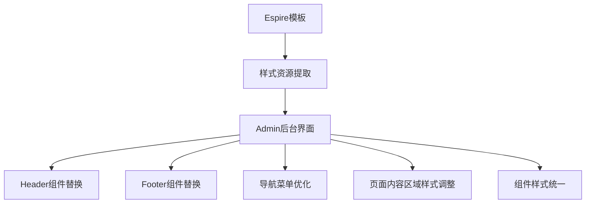
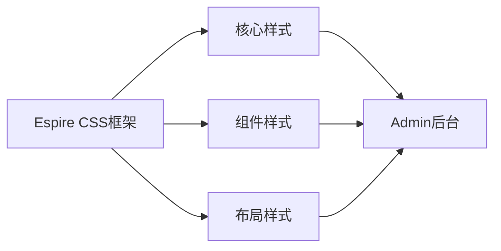
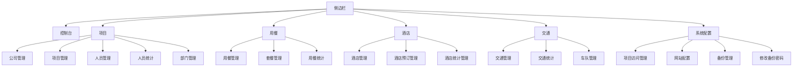

# Espire模板样式调整设计文档

## 1. 概述

### 1.1 项目背景
本项目旨在将admin目录下的后端管理界面按照Espire模板进行样式调整，实现"换皮"效果。在保持原有功能不变的前提下，提升界面的现代化程度和用户体验。

### 1.2 设计目标
- 保持后端功能逻辑完全不变
- 应用Espire模板的视觉设计风格
- 统一界面组件样式（按钮、表格、卡片等）
- 优化布局结构，提升用户体验
- 确保响应式设计在各种设备上正常显示
- 保持特定页面的业务逻辑不变，包括人员管理、部门管理、套餐管理、酒店预订管理、交通管理等页面的"先选项目再显示具体业务"逻辑

### 1.3 设计原则
- 功能不变性：仅调整样式，不修改任何后端逻辑
- 样式一致性：统一使用Espire模板的设计语言
- 渐进式改造：优先改造核心页面，逐步扩展到所有页面
- 兼容性保障：确保在主流浏览器中正常显示
- 业务逻辑保持：特定页面（人员管理、部门管理、套餐管理、酒店预订管理、交通管理）必须保持原有的"先选项目再显示具体业务"逻辑不变
- 功能完整性：除样式调整外，其他所有页面的原有业务逻辑均不得改变

## 2. 架构设计

### 2.1 整体架构


### 2.2 样式架构


### 2.3 文件结构调整
- 将Espire的CSS/JS资源按目录结构移动到admin/assets目录下
- 替换原有的Bootstrap样式引用
- 保持PHP逻辑代码不变
- 重构HTML结构以适配Espire模板

## 3. 资源迁移方案

### 3.1 目录结构创建
在执行资源迁移之前，需要创建以下目录结构：
- admin/assets/image/
- admin/assets/picture/
- admin/assets/font/

注意：admin/assets/css/和admin/assets/js/目录已存在，但需要将Espire的资源文件合并到现有目录中。

需要创建的目录：
- admin/assets/image/
- admin/assets/picture/
- admin/assets/font/

这些目录目前尚不存在，需要手动创建。

创建命令：
```bash
mkdir -p /www/wwwroot/livegig.cn/admin/assets/image
mkdir -p /www/wwwroot/livegig.cn/admin/assets/picture
mkdir -p /www/wwwroot/livegig.cn/admin/assets/font
```

### 3.3 CSS资源迁移
将以下CSS文件从`Espire/static/css/`目录复制到`admin/assets/css/`目录：
- app.min.css
- apexcharts.css
- css2.css
- dataTables.bootstrap.min.css
- main.min.css
- perfect-scrollbar.css

注意：需要保留原有的admin.css文件，将Espire的CSS文件与之合并或在页面中同时引用。

### 3.4 JS资源迁移
将以下JS文件从`Espire/static/js/`目录复制到`admin/assets/js/`目录：
- app.min.js
- apexcharts.min.js
- calendar.js
- chart.js
- chat.js
- dashboard.js
- dataTables.bootstrap.min.js
- form-validation.js
- icon.js
- jquery.dataTables.min.js
- jquery.validate.min.js
- mail.js
- main.min.js
- quill.min.js
- user-list.js
- vendors.min.js

注意：需要保留原有的datatables-zh.js文件，将Espire的JS文件与之共存。

### 3.5 图片资源迁移
将以下图片资源从`Espire/static/image/`目录复制到`admin/assets/image/`目录：
- bg-1.jpg
- bg-2.jpg
- bg-3.jpg
- bg-4.jpg

将以下图片资源从`Espire/static/picture/`目录复制到`admin/assets/picture/`目录：
- 所有.png和.jpg文件

### 3.5 字体资源迁移
将字体资源从`Espire/static/font/`目录复制到`admin/assets/font/`目录：
- 所有字体文件

### 3.5 目录结构创建
在执行资源迁移之前，需要创建以下目录结构：
- admin/assets/image/
- admin/assets/picture/
- admin/assets/font/

注意：admin/assets/css/和admin/assets/js/目录已存在，但需要将Espire的资源文件合并到现有目录中。

需要创建的目录：
- admin/assets/image/
- admin/assets/picture/
- admin/assets/font/

这些目录目前尚不存在，需要手动创建。

创建命令：
```bash
mkdir -p /www/wwwroot/livegig.cn/admin/assets/image
mkdir -p /www/wwwroot/livegig.cn/admin/assets/picture
mkdir -p /www/wwwroot/livegig.cn/admin/assets/font
```

## 3. 核心组件设计

### 3.1 头部导航栏
#### 设计要点
- 采用Espire的顶部导航设计
- 保留管理员信息显示功能
- 集成通知、设置等通用功能
- 保持原有的登出功能

#### 样式对比
| 原有样式 | Espire样式 |
|---------|-----------|
| Bootstrap导航 | Espire水平导航 |
| 简单链接 | 图标+文字组合 |
| 基础下拉 | 美化下拉菜单 |

### 3.2 侧边栏菜单
#### 设计要点
- 使用Espire的侧边栏组件
- 保持原有的菜单结构和链接
- 优化折叠/展开交互效果
- 适配移动端显示

#### 菜单结构调整


### 3.3 内容区域
#### 设计要点
- 使用Espire的卡片组件展示内容
- 统计数据采用Espire的统计卡片样式
- 表格使用Espire的数据表格样式
- 按钮组件替换为Espire样式

#### 组件映射关系
| 原组件 | Espire组件 | 说明 |
|-------|-----------|------|
| Bootstrap卡片 | Espire卡片 | 统计数据展示 |
| 原生表格 | Espire数据表 | 数据列表展示 |
| Bootstrap按钮 | Espire按钮 | 操作按钮 |
| 原生表单 | Espire表单 | 数据录入 |

## 4. 页面样式调整方案

### 4.1 控制台页面(index.php)
#### 调整内容
1. 头部区域：
   - 替换为Espire导航栏
   - 保留管理员信息和登出功能
   - 添加通知和设置图标

2. 统计卡片：
   - 使用Espire卡片组件
   - 调整图标和颜色方案
   - 优化数据展示布局

3. 快速操作区域：
   - 使用Espire按钮样式
   - 优化网格布局

4. 最近项目列表：
   - 使用Espire数据表格
   - 优化列宽和间距

### 4.2 登录页面(login.php)
#### 调整内容
1. 页面布局：
   - 采用Espire登录页面布局
   - 居中显示登录表单

2. 表单组件：
   - 使用Espire表单元素
   - 添加图标和视觉效果

3. 品牌展示：
   - 使用Espire的Logo展示方式

### 4.3 其他管理页面
#### 通用调整原则
1. 头部和侧边栏：
   - 统一使用Espire导航组件

2. 内容区域：
   - 使用Espire卡片容器
   - 表格替换为Espire数据表
   - 按钮替换为Espire按钮

3. 表单页面：
   - 使用Espire表单组件
   - 优化标签和输入框样式

#### 业务逻辑保持要求
1. 以下页面必须保持原有的"先选项目再显示具体业务"逻辑：
   - 人员管理页面
   - 部门管理页面
   - 套餐管理页面
   - 酒店预订管理页面
   - 交通管理页面

2. 所有其他页面的原有业务逻辑均不得改变，仅进行样式调整

### 4.4 侧边栏导航结构调整
#### 调整内容
1. 统一应用模板的侧边栏导航结构
2. 保持原有的菜单项和链接不变
3. 应用Espire的交互模式（折叠/展开效果）
4. 优化移动端导航体验
5. 统一菜单项的图标和文字样式

### 4.5 表单控件和验证提示优化
#### 调整内容
1. 统一表单控件的视觉呈现
2. 优化验证提示的显示效果
3. 保持原有的表单功能不变
4. 应用Espire的表单布局和间距标准
5. 统一输入框、下拉框、复选框等控件样式

## 5. 样式资源集成

### 5.1 CSS资源
| 资源文件 | 用途 | 集成方式 |
|---------|------|---------|
| app.min.css | 核心样式 | 替换原有Bootstrap |
| 图标库 | 图标资源 | 集成Feather图标 |
| 响应式样式 | 移动端适配 | 直接使用Espire响应式 |

### 5.2 JS资源
| 资源文件 | 用途 | 集成方式 |
|---------|------|---------|
| vendors.min.js | 第三方库 | 替换原有Bootstrap JS |
| app.min.js | 核心脚本 | 集成Espire交互效果 |

### 5.3 字体资源
- 使用Espire默认字体
- 集成Google Fonts "Inter"
- 确保中文字体兼容性

### 5.4 UI组件库移植
#### 移植内容
1. 按钮样式统一
   - 应用Espire按钮颜色、尺寸和交互效果
   - 保持原有按钮功能和事件处理不变
2. 卡片组件样式统一
   - 使用Espire卡片设计语言
   - 统一卡片标题、内容和操作区域样式
3. 表格样式统一
   - 应用Espire数据表格样式
   - 保持原有数据展示和分页功能
4. 其他组件样式统一
   - 标签、徽章、进度条等组件样式调整
   - 保持原有功能不变
5. 组件交互效果优化
   - 应用Espire的悬停、点击等交互效果
   - 确保组件在各种浏览器中表现一致

## 6. 响应式设计

### 6.1 移动端适配
- 侧边栏在移动端变为抽屉式菜单
- 表格在小屏幕设备上可横向滚动
- 按钮和表单元素自动调整大小

### 6.2 平板适配
- 菜单在中等屏幕设备上可折叠
- 内容区域采用自适应网格布局
- 统计卡片调整为两列布局

### 6.3 桌面端适配
- 充分利用屏幕空间展示内容
- 保持Espire的完整功能体验
- 优化多窗口操作体验

## 7. 数据可视化标准化

### 7.1 图表样式统一
- 标准化所有图表的展示风格
- 统一颜色方案和字体大小
- 保持原有的数据展示功能
- 应用Espire的图表配色方案

### 7.2 数据可视化元素优化
- 优化图表交互效果
- 统一图例和标签样式
- 保持响应式设计
- 应用Espire的图表动画效果
- 统一工具提示样式和位置

### 7.3 图表组件适配
- 保持原有图表数据源不变
- 适配Espire图表组件API
- 确保图表在不同分辨率下的显示效果

## 7. 兼容性考虑

### 7.1 浏览器兼容性
- Chrome最新版本
- Firefox最新版本
- Safari最新版本
- Edge最新版本

### 7.2 设备兼容性
- 桌面设备：1024px以上屏幕
- 平板设备：768px-1024px屏幕
- 手机设备：768px以下屏幕

## 8. 实施计划

### 8.1 第一阶段：基础框架搭建
- 创建必要的资源目录结构（image、picture、font）
- 复制Espire CSS资源到admin/assets/css目录
- 复制Espire JS资源到admin/assets/js目录
- 复制图片和字体资源到相应目录
- 替换头部和底部组件
- 调整导航菜单结构
- 统一应用模板的侧边栏导航结构和交互模式

### 8.2 第二阶段：核心页面改造
- 控制台页面样式调整
- 登录页面样式调整
- 表单控件和验证提示的视觉呈现优化
- 验证功能完整性

### 8.3 第三阶段：其他页面改造
- 逐个调整管理页面
- 统一组件样式
- 优化交互体验
- 移植模板的UI组件库（包括按钮、卡片、表格等样式）
- 标准化所有图表和数据可视化元素的展示风格

### 8.4 第四阶段：测试与优化
- 跨浏览器测试
- 响应式效果验证
- 性能优化调整

## 9. 资源迁移执行

### 9.1 创建目录结构
首先执行目录创建命令：
```bash
mkdir -p /www/wwwroot/livegig.cn/admin/assets/image
mkdir -p /www/wwwroot/livegig.cn/admin/assets/picture
mkdir -p /www/wwwroot/livegig.cn/admin/assets/font
```

### 9.2 执行资源复制
然后执行资源复制命令：
```bash
cp /www/wwwroot/livegig.cn/Espire/static/css/*.css /www/wwwroot/livegig.cn/admin/assets/css/
cp /www/wwwroot/livegig.cn/Espire/static/js/*.js /www/wwwroot/livegig.cn/admin/assets/js/
cp /www/wwwroot/livegig.cn/Espire/static/image/*.* /www/wwwroot/livegig.cn/admin/assets/image/
cp /www/wwwroot/livegig.cn/Espire/static/picture/*.* /www/wwwroot/livegig.cn/admin/assets/picture/
cp /www/wwwroot/livegig.cn/Espire/static/font/*.* /www/wwwroot/livegig.cn/admin/assets/font/
```

### 9.3 验证资源迁移
检查所有资源是否已正确复制到目标目录。