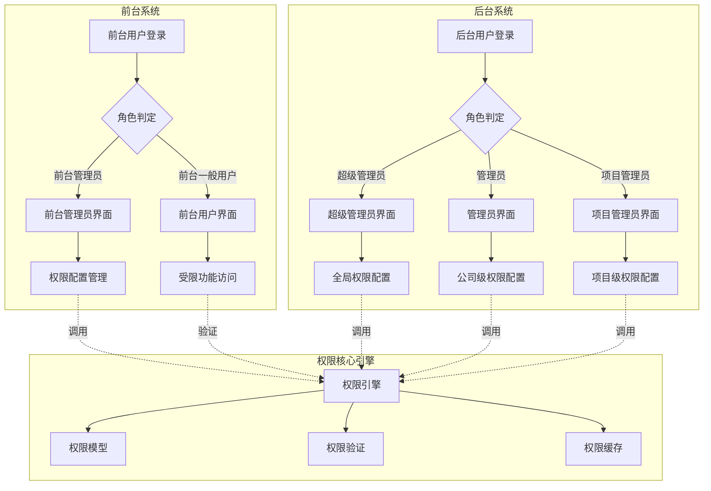
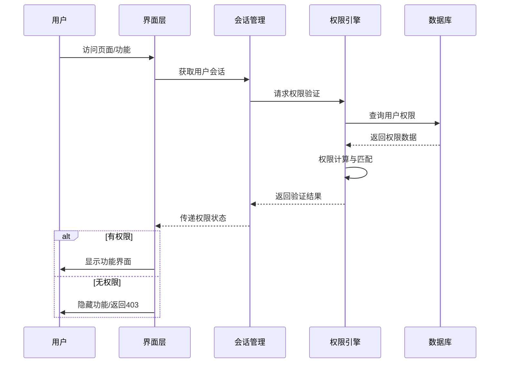
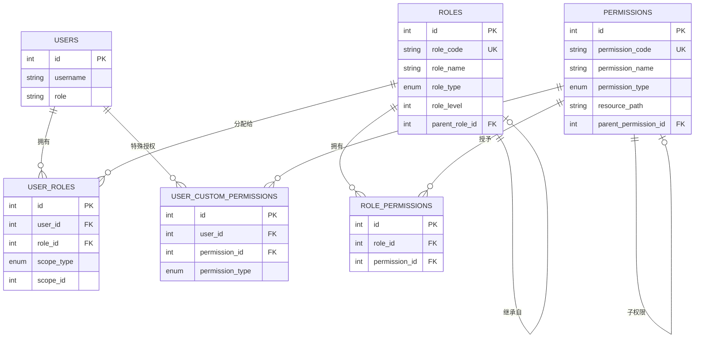
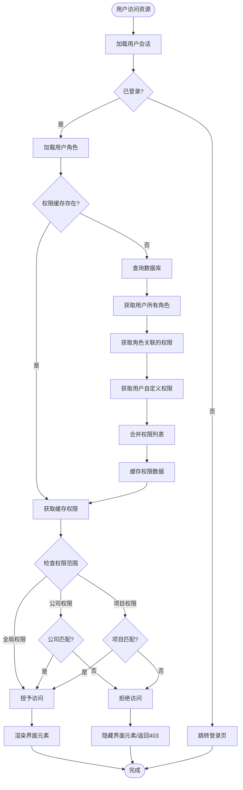
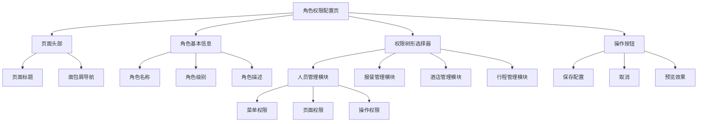
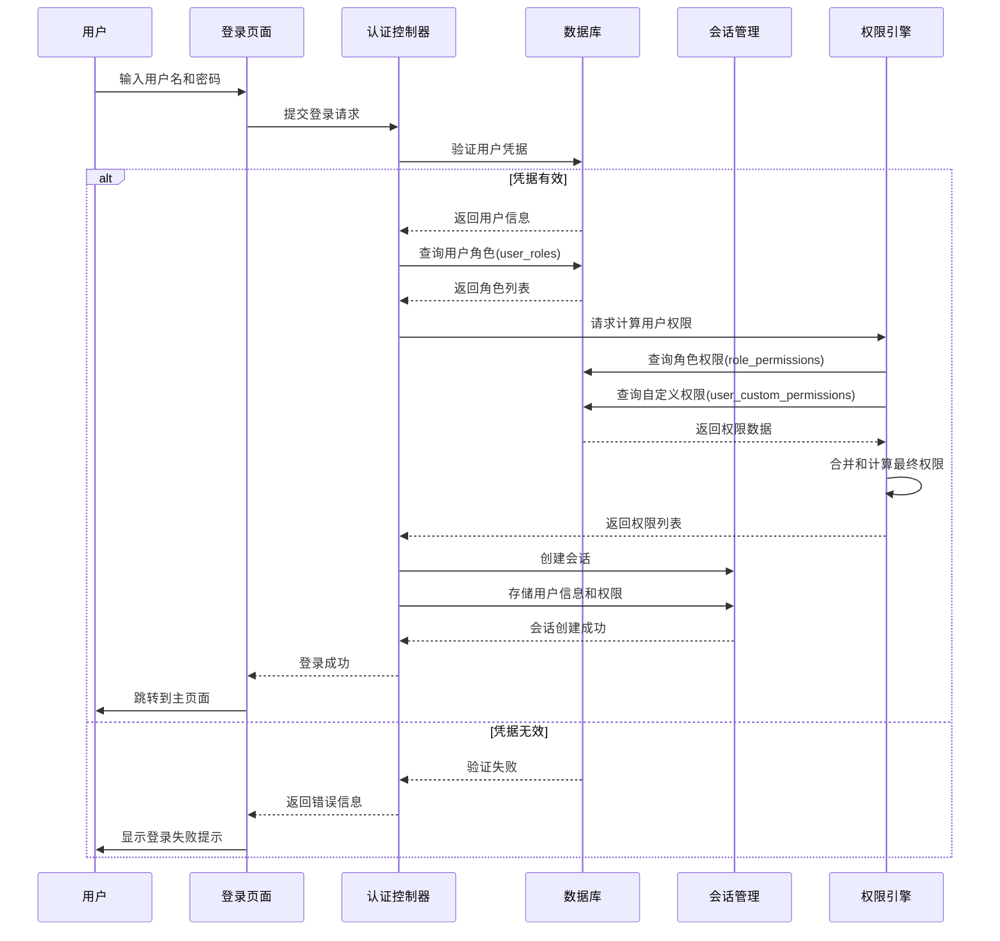
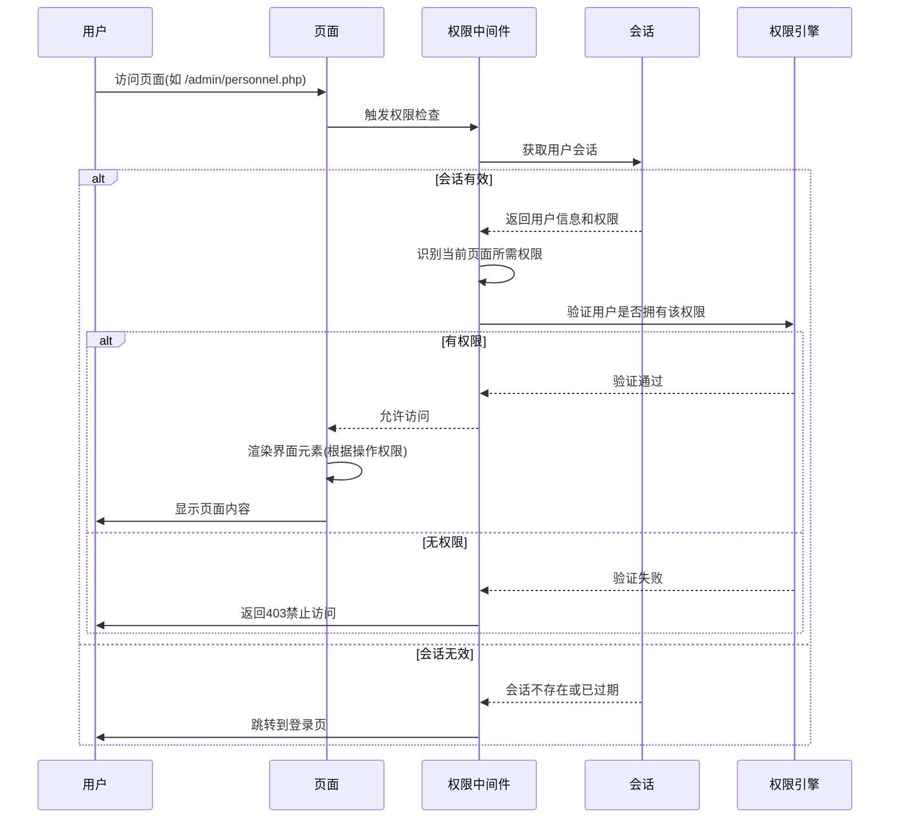
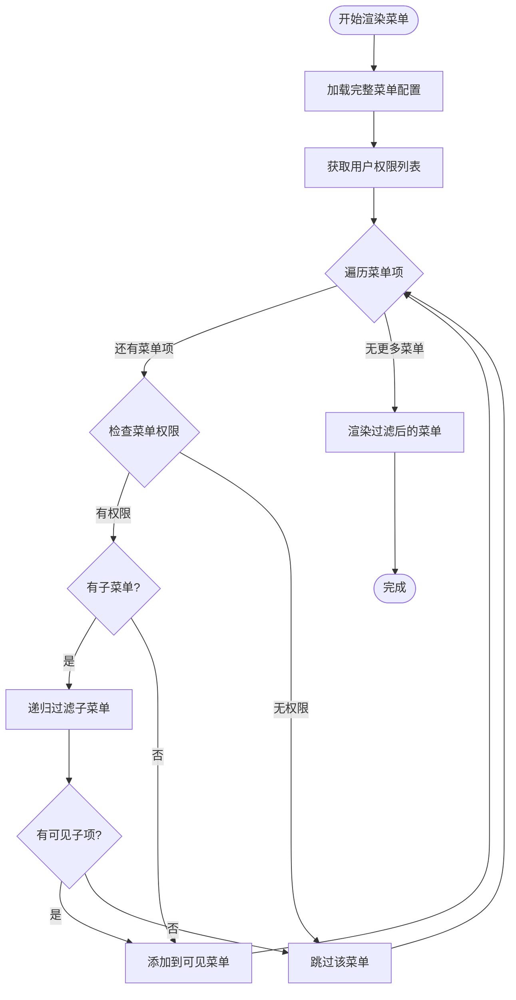
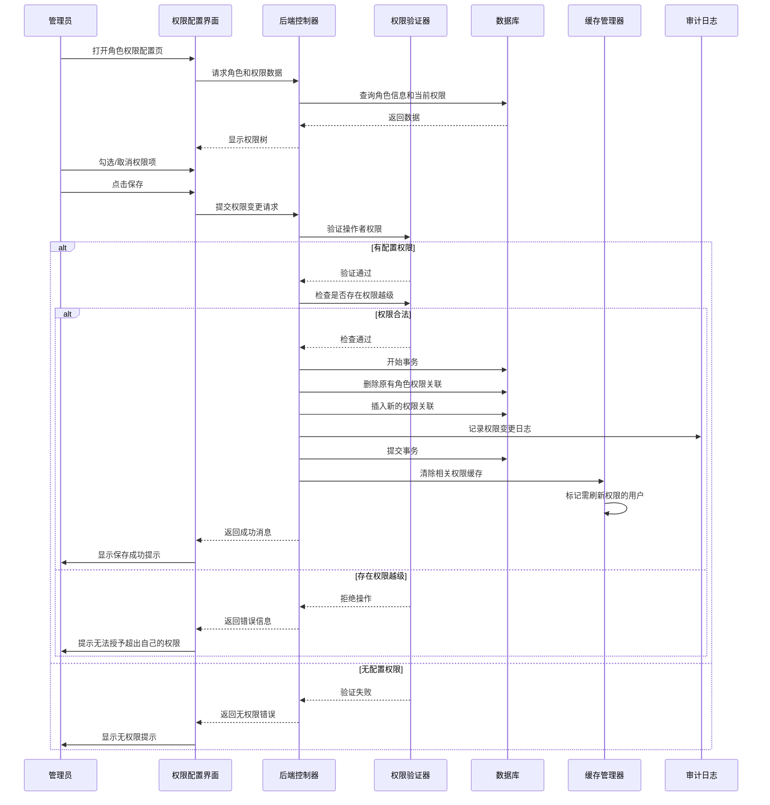
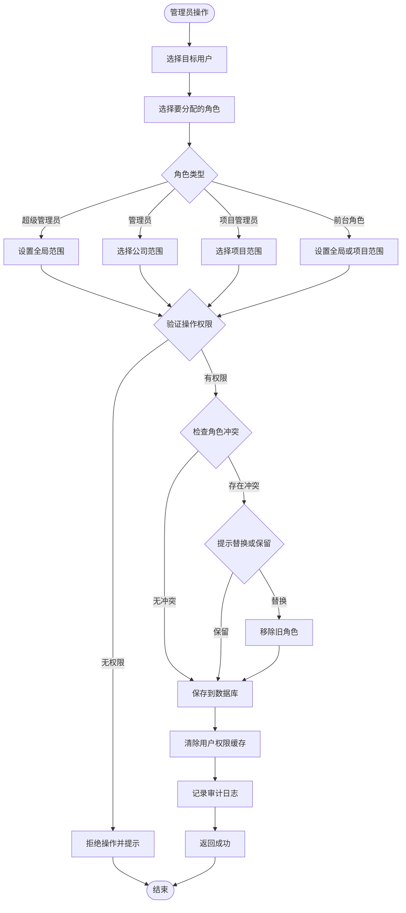

# 多级权限管理系统设计文档

## 1. 概述

### 1.1 设计目标

本设计旨在为Espire企业项目管理系统建立一套**前后台分离的多级权限管理体系**,实现精细化的功能访问控制和界面可见性管理。核心设计理念为"**不可见即无权限**"——用户只能看到和访问其被授权的功能,未授权功能在界面中完全隐藏。

### 1.2 权限体系架构

系统分为**前台权限体系(两级)**和**后台权限体系(三级)**:

#### 前台权限体系
- **前台管理员**: 配置前台一般用户的页面访问权限和功能使用权限
- **前台一般用户**: 根据分配的权限访问相应功能

#### 后台权限体系
- **超级管理员**: 拥有所有后台功能的完全权限,配置管理员和项目管理员的功能访问权限和页面可见性
- **管理员**: 基于所属公司权限,管理该公司下所有项目的功能和页面访问权限
- **项目管理员**: 仅管理指定项目的功能和页面访问权限

### 1.3 核心设计原则

| 原则 | 说明 | 实现方式 |
|------|------|----------|
| 最小权限原则 | 默认无权限,需显式授权 | 新用户/新角色默认无任何权限 |
| 界面不可见性 | 未授权功能不显示 | 菜单/按钮/链接渲染前进行权限检查 |
| 双重验证 | 前端隐藏+后端拦截 | 界面隐藏的同时,后端接口也进行权限验证 |
| 层级继承性 | 下级角色权限不超越上级 | 项目管理员权限≤管理员权限≤超级管理员权限 |
| 审计可追溯 | 权限变更可追踪 | 记录权限分配/撤销的操作日志 |

---

## 2. 架构设计

### 2.1 总体架构



### 2.2 数据流架构



---

## 3. 数据模型设计

### 3.1 核心数据表结构

#### 3.1.1 角色表 (roles)

| 字段名 | 类型 | 说明 | 约束 |
|--------|------|------|------|
| id | INT | 角色ID | 主键,自增 |
| role_code | VARCHAR(50) | 角色代码 | 唯一,不为空 |
| role_name | VARCHAR(100) | 角色名称 | 不为空 |
| role_type | ENUM | 角色类型 | 'frontend','backend' |
| role_level | INT | 角色级别 | 数字越小权限越高 |
| parent_role_id | INT | 父角色ID | 外键,可为空 |
| description | TEXT | 角色描述 | 可为空 |
| is_system | TINYINT | 是否系统角色 | 1=系统预设,0=自定义 |
| is_active | TINYINT | 是否启用 | 1=启用,0=禁用 |
| created_at | TIMESTAMP | 创建时间 | 默认当前时间 |
| updated_at | TIMESTAMP | 更新时间 | 自动更新 |

**预设角色数据**:

| role_code | role_name | role_type | role_level | parent_role_id |
|-----------|-----------|-----------|------------|----------------|
| super_admin | 超级管理员 | backend | 1 | NULL |
| company_admin | 管理员 | backend | 2 | 1 |
| project_admin | 项目管理员 | backend | 3 | 2 |
| frontend_admin | 前台管理员 | frontend | 10 | NULL |
| frontend_user | 前台一般用户 | frontend | 11 | 10 |

#### 3.1.2 权限资源表 (permissions)

| 字段名 | 类型 | 说明 | 约束 |
|--------|------|------|------|
| id | INT | 权限ID | 主键,自增 |
| permission_code | VARCHAR(100) | 权限代码 | 唯一,不为空 |
| permission_name | VARCHAR(100) | 权限名称 | 不为空 |
| permission_type | ENUM | 权限类型 | 'menu','page','action','api' |
| resource_path | VARCHAR(255) | 资源路径 | 如: /admin/personnel.php |
| parent_permission_id | INT | 父权限ID | 外键,用于菜单层级 |
| module | VARCHAR(50) | 所属模块 | 如: personnel,hotel,meal |
| display_order | INT | 显示顺序 | 用于菜单排序 |
| icon | VARCHAR(50) | 图标 | Bootstrap Icons类名 |
| description | TEXT | 权限描述 | 可为空 |
| is_active | TINYINT | 是否启用 | 1=启用,0=禁用 |
| created_at | TIMESTAMP | 创建时间 | 默认当前时间 |

**权限类型说明**:
- **menu**: 菜单项权限(控制左侧菜单显示)
- **page**: 页面访问权限(控制整个页面访问)
- **action**: 功能操作权限(如:添加、编辑、删除按钮)
- **api**: 接口调用权限(后端API访问控制)

#### 3.1.3 角色权限关联表 (role_permissions)

| 字段名 | 类型 | 说明 | 约束 |
|--------|------|------|------|
| id | INT | 关联ID | 主键,自增 |
| role_id | INT | 角色ID | 外键,不为空 |
| permission_id | INT | 权限ID | 外键,不为空 |
| granted_by | INT | 授权人ID | 外键,记录谁授予的权限 |
| created_at | TIMESTAMP | 授权时间 | 默认当前时间 |

**唯一索引**: (role_id, permission_id)

#### 3.1.4 用户角色关联表 (user_roles)

| 字段名 | 类型 | 说明 | 约束 |
|--------|------|------|------|
| id | INT | 关联ID | 主键,自增 |
| user_id | INT | 用户ID | 外键,不为空 |
| role_id | INT | 角色ID | 外键,不为空 |
| scope_type | ENUM | 权限范围类型 | 'global','company','project' |
| scope_id | INT | 范围ID | 公司ID或项目ID |
| assigned_by | INT | 分配人ID | 外键,记录谁分配的角色 |
| is_active | TINYINT | 是否有效 | 1=有效,0=失效 |
| created_at | TIMESTAMP | 分配时间 | 默认当前时间 |
| expires_at | TIMESTAMP | 过期时间 | 可为空,支持临时授权 |

**唯一索引**: (user_id, role_id, scope_type, scope_id)

**scope_type 说明**:
- **global**: 全局范围(如超级管理员)
- **company**: 公司范围(管理员仅管理特定公司)
- **project**: 项目范围(项目管理员仅管理特定项目)

#### 3.1.5 用户自定义权限表 (user_custom_permissions)

| 字段名 | 类型 | 说明 | 约束 |
|--------|------|------|------|
| id | INT | 关联ID | 主键,自增 |
| user_id | INT | 用户ID | 外键,不为空 |
| permission_id | INT | 权限ID | 外键,不为空 |
| permission_type | ENUM | 权限操作类型 | 'grant','deny' |
| scope_type | ENUM | 权限范围类型 | 'global','company','project' |
| scope_id | INT | 范围ID | 可为空 |
| assigned_by | INT | 分配人ID | 外键 |
| reason | VARCHAR(255) | 授权原因 | 可为空 |
| created_at | TIMESTAMP | 分配时间 | 默认当前时间 |
| expires_at | TIMESTAMP | 过期时间 | 可为空 |

**说明**: 此表用于特殊情况下为用户单独授予或撤销某项权限,优先级高于角色权限。

#### 3.1.6 权限审计日志表 (permission_audit_logs)

| 字段名 | 类型 | 说明 | 约束 |
|--------|------|------|------|
| id | BIGINT | 日志ID | 主键,自增 |
| operation_type | ENUM | 操作类型 | 'grant_role','revoke_role','grant_permission','deny_permission' |
| operator_id | INT | 操作人ID | 外键,不为空 |
| target_user_id | INT | 目标用户ID | 外键 |
| target_role_id | INT | 目标角色ID | 外键 |
| permission_id | INT | 权限ID | 外键 |
| scope_type | VARCHAR(20) | 范围类型 | 可为空 |
| scope_id | INT | 范围ID | 可为空 |
| before_value | TEXT | 变更前数据 | JSON格式 |
| after_value | TEXT | 变更后数据 | JSON格式 |
| ip_address | VARCHAR(45) | 操作IP | IPv4/IPv6 |
| user_agent | VARCHAR(255) | 浏览器信息 | 可为空 |
| created_at | TIMESTAMP | 操作时间 | 默认当前时间 |

### 3.2 数据关系图



---

## 4. 权限验证机制设计

### 4.1 权限验证流程



### 4.2 权限计算规则

#### 4.2.1 权限优先级

权限计算遵循以下优先级顺序(从高到低):

1. **用户自定义拒绝权限** (user_custom_permissions.permission_type = 'deny')
2. **用户自定义授予权限** (user_custom_permissions.permission_type = 'grant')
3. **用户角色权限** (通过 user_roles → role_permissions 获取)
4. **默认无权限**

#### 4.2.2 权限合并算法描述

对于用户访问某项资源时,权限验证引擎执行以下步骤:

**步骤1**: 识别用户ID和目标资源的permission_code

**步骤2**: 查询用户自定义拒绝权限
- 若存在 `deny` 类型的自定义权限,直接返回 **无权限**
- 若不存在,继续下一步

**步骤3**: 查询用户自定义授予权限
- 若存在 `grant` 类型的自定义权限,直接返回 **有权限**
- 若不存在,继续下一步

**步骤4**: 查询用户所有有效角色
- 从 `user_roles` 表获取该用户所有 `is_active=1` 且未过期的角色
- 根据当前访问上下文过滤范围(scope_type 和 scope_id)

**步骤5**: 获取角色权限集合
- 遍历用户角色,查询 `role_permissions` 表
- 汇总所有角色拥有的 permission_id

**步骤6**: 权限匹配判定
- 若目标资源的 permission_id 在权限集合中,返回 **有权限**
- 否则返回 **无权限**

#### 4.2.3 范围权限验证

对于具有范围限制的权限(如管理员仅能管理所属公司),需额外验证:

| 角色类型 | 范围验证规则 |
|---------|-------------|
| 超级管理员 | 无范围限制,可访问所有资源 |
| 公司管理员 | 验证 `scope_type='company'` 且 `scope_id` 匹配当前操作的公司ID |
| 项目管理员 | 验证 `scope_type='project'` 且 `scope_id` 匹配当前操作的项目ID |
| 前台管理员 | 验证 `scope_type='global'` 或指定项目范围 |
| 前台用户 | 继承前台管理员配置的权限范围 |

### 4.3 会话权限缓存机制

#### 4.3.1 缓存策略

为提高性能,避免每次请求都查询数据库,采用以下缓存机制:

| 缓存位置 | 缓存内容 | 缓存时长 | 失效条件 |
|---------|---------|---------|---------|
| Session | 用户权限列表 | 会话期间 | 用户登出、权限变更 |
| 内存缓存(可选) | 角色权限映射 | 30分钟 | 角色权限配置变更 |

#### 4.3.2 缓存数据结构

用户会话中存储的权限缓存结构(JSON示例):

```
{
  "user_id": 21,
  "roles": [
    {
      "role_id": 2,
      "role_code": "company_admin",
      "scope_type": "company",
      "scope_id": 2
    }
  ],
  "permissions": [
    "menu.personnel",
    "page.personnel.list",
    "action.personnel.add",
    "action.personnel.edit",
    "api.personnel.create"
  ],
  "custom_permissions": {
    "granted": ["action.hotel.delete"],
    "denied": ["action.project.delete"]
  },
  "cached_at": "2025-01-15 10:30:00",
  "expires_at": null
}
```

#### 4.3.3 缓存刷新机制

触发权限缓存刷新的场景:

1. 用户角色被添加或移除
2. 角色权限配置发生变更
3. 用户自定义权限被授予或撤销
4. 管理员主动刷新权限缓存
5. 缓存超时(可选,用于长时间会话)

---

## 5. 功能模块设计

### 5.1 后台权限管理模块

#### 5.1.1 超级管理员功能

**角色管理**

| 功能 | 描述 | 页面路径(示例) |
|------|------|---------------|
| 角色列表 | 查看所有系统角色 | /admin/roles/list.php |
| 创建角色 | 新建自定义角色 | /admin/roles/create.php |
| 编辑角色 | 修改角色信息和权限 | /admin/roles/edit.php?id={role_id} |
| 删除角色 | 删除非系统角色 | 操作按钮(需二次确认) |
| 角色权限配置 | 为角色分配权限 | /admin/roles/permissions.php?id={role_id} |

**管理员管理**

| 功能 | 描述 | 实现要点 |
|------|------|---------|
| 查看所有管理员 | 列出系统中所有管理员及其管理范围 | 显示:姓名、所属公司、管理的项目数量 |
| 分配管理员角色 | 为用户分配"管理员"角色并指定公司范围 | 选择用户、选择公司、自动设置scope_type='company' |
| 配置管理员权限 | 为管理员自定义功能权限 | 可在角色默认权限基础上增减特定权限 |
| 停用管理员 | 暂时撤销管理员权限 | 设置 user_roles.is_active=0 |

**项目管理员管理**

| 功能 | 描述 | 实现要点 |
|------|------|---------|
| 查看项目管理员 | 列出所有项目管理员及其管理的项目 | 显示:姓名、管理的项目名称、权限范围 |
| 分配项目管理员 | 为用户分配"项目管理员"角色并指定项目 | 选择用户、选择项目、设置scope_type='project' |
| 批量分配 | 为同一用户分配多个项目的管理权限 | 支持多选项目 |

**权限资源管理**

| 功能 | 描述 | 实现要点 |
|------|------|---------|
| 权限列表 | 查看所有权限资源 | 树形结构展示权限层级 |
| 新增权限 | 添加新的权限项 | 指定权限代码、类型、资源路径 |
| 编辑权限 | 修改权限信息 | 不允许修改系统预设权限的核心属性 |
| 禁用权限 | 停用某项权限 | 所有拥有该权限的角色/用户将无法使用 |

#### 5.1.2 管理员功能

**权限范围**: 仅能管理所属公司下的项目和人员

| 功能 | 描述 | 权限限制 |
|------|------|---------|
| 查看公司项目 | 列出所属公司的所有项目 | 只能看到 company_id 匹配的项目 |
| 分配项目管理员 | 为项目指定管理员 | 只能为本公司项目分配管理员 |
| 配置项目管理员权限 | 设置项目管理员的功能权限 | 不能授予超出自己权限范围的权限 |
| 查看项目人员 | 查看项目下的所有人员 | 仅限本公司项目 |

**权限配置界面**:
- 展示功能模块树形结构(如:人员管理、报餐管理、酒店管理等)
- 每个模块下显示具体权限项(查看、添加、编辑、删除、导出等)
- 支持批量勾选/取消勾选

#### 5.1.3 项目管理员功能

**权限范围**: 仅能管理指定的项目

| 功能 | 描述 | 权限限制 |
|------|------|---------|
| 查看项目信息 | 查看被分配项目的基本信息 | 只能看到自己管理的项目 |
| 管理项目人员 | 添加/编辑/删除项目人员 | 仅限被授权的项目,且需有相应操作权限 |
| 查看项目数据 | 查看报餐、酒店、交通等数据 | 根据分配的具体权限决定 |
| 导出项目报表 | 导出项目相关数据 | 需单独授予导出权限 |

### 5.2 前台权限管理模块

#### 5.2.1 前台管理员功能

| 功能 | 描述 | 页面路径(示例) |
|------|------|---------------|
| 用户权限配置 | 为前台用户分配功能权限 | /user/admin/permissions.php |
| 功能模块管理 | 配置前台可用的功能模块 | /user/admin/modules.php |
| 菜单可见性控制 | 设置各用户可见的菜单项 | /user/admin/menu_visibility.php |
| 查看权限日志 | 查看前台用户权限变更记录 | /user/admin/permission_logs.php |

**前台功能模块定义**:

| 模块代码 | 模块名称 | 包含的功能权限 |
|---------|---------|--------------|
| personnel | 人员管理 | 查看人员列表、添加人员、编辑人员信息、查看个人资料 |
| meal | 报餐管理 | 批量报餐、查看报餐统计、查看报餐记录、查看餐费补助 |
| hotel | 酒店管理 | 添加入住、查看入住记录、查看入住统计、查看房表 |
| transport | 行程管理 | 快速安排、批量安排、查看行程列表、导出行程 |
| dashboard | 仪表板 | 查看项目概况、查看统计图表 |

#### 5.2.2 前台一般用户功能

**权限继承规则**:
- 前台用户的权限完全由前台管理员配置
- 用户登录后,系统读取其被授予的权限列表
- 界面渲染时,仅显示有权限的菜单和功能入口

**无权限时的界面行为**:
- 菜单项完全不显示(而非显示为禁用状态)
- 功能按钮不渲染
- 直接访问无权限页面时,返回403错误或跳转到无权限提示页

### 5.3 权限配置界面设计

#### 5.3.1 角色权限配置页面结构



#### 5.3.2 用户权限分配页面结构

**页面布局**:

| 区域 | 内容 | 交互方式 |
|------|------|---------|
| 左侧面板 | 用户列表 | 可搜索、筛选、分页 |
| 右侧面板(上) | 选中用户的基本信息和当前角色 | 显示用户名、所属部门、当前角色标签 |
| 右侧面板(中) | 角色分配选择器 | 下拉选择或单选按钮组 |
| 右侧面板(下) | 范围选择器 | 根据角色类型显示(公司选择器/项目选择器) |
| 底部面板 | 自定义权限配置(可选) | 权限树形勾选框,支持单独授予或拒绝特定权限 |
| 操作按钮区 | 保存、取消、重置 | 固定在页面底部或右下角 |

---

## 6. 业务流程设计

### 6.1 用户登录与权限加载流程



### 6.2 页面访问权限验证流程



### 6.3 菜单渲染权限过滤流程



**菜单过滤伪代码逻辑**:

```
函数 过滤菜单(菜单配置, 用户权限列表):
    可见菜单 = 空列表
    
    对于 每个菜单项 在 菜单配置 中:
        如果 菜单项.权限代码 在 用户权限列表 中:
            如果 菜单项.有子菜单:
                过滤后的子菜单 = 过滤菜单(菜单项.子菜单, 用户权限列表)
                
                如果 过滤后的子菜单 不为空:
                    菜单项.子菜单 = 过滤后的子菜单
                    添加 菜单项 到 可见菜单
            否则:
                添加 菜单项 到 可见菜单
    
    返回 可见菜单
```

### 6.4 角色权限分配流程



### 6.5 用户角色分配流程



---

## 7. 界面元素权限控制

### 7.1 菜单权限控制

#### 7.1.1 后台菜单控制规则

**后台侧边栏菜单配置示例**:

| 菜单项 | 权限代码 | 角色要求 | 显示条件 |
|--------|---------|---------|---------|
| 仪表板 | menu.dashboard | 所有后台角色 | 始终显示 |
| 人员管理 | menu.personnel | 超级管理员、管理员、项目管理员 | 拥有人员模块任一权限 |
| ├ 添加人员 | menu.personnel.add | 有添加人员权限 | 拥有 action.personnel.add |
| ├ 人员列表 | menu.personnel.list | 有查看人员权限 | 拥有 page.personnel.list |
| 项目管理 | menu.projects | 超级管理员、管理员 | 拥有项目模块任一权限 |
| 公司管理 | menu.companies | 仅超级管理员 | role_level <= 1 |
| 部门管理 | menu.departments | 超级管理员、管理员 | 拥有部门模块任一权限 |
| 系统设置 | menu.system | 仅超级管理员 | role_level = 1 |
| ├ 角色管理 | menu.system.roles | 仅超级管理员 | role_level = 1 |
| ├ 权限管理 | menu.system.permissions | 仅超级管理员 | role_level = 1 |

**菜单渲染逻辑**:

在 `includes/sidebar.php` 或类似菜单组件中,渲染前执行权限检查:

```
对于每个菜单项:
    如果 用户权限列表 包含 菜单项.权限代码:
        如果 菜单项有子菜单:
            递归过滤子菜单
            如果 过滤后有可见子项:
                渲染该菜单项
        否则:
            渲染该菜单项
    否则:
        跳过不渲染
```

#### 7.1.2 前台菜单控制规则

**前台顶部导航菜单配置示例**:

| 菜单项 | 权限代码 | 默认启用 | 说明 |
|--------|---------|---------|------|
| 人员 | menu.frontend.personnel | 是 | 包含添加人员、人员管理子菜单 |
| 报餐 | menu.frontend.meal | 是 | 包含报餐、统计、记录、补助子菜单 |
| 酒店 | menu.frontend.hotel | 是 | 包含添加入住、记录、统计子菜单 |
| 行程 | menu.frontend.transport | 是 | 包含快速安排、批量安排、列表子菜单 |

**子菜单权限细化**:

| 父菜单 | 子菜单项 | 权限代码 |
|-------|---------|---------|
| 人员 | 添加人员 | menu.frontend.personnel.add |
| 人员 | 人员管理 | menu.frontend.personnel.list |
| 报餐 | 报餐 | menu.frontend.meal.order |
| 报餐 | 报餐统计 | menu.frontend.meal.statistics |
| 报餐 | 报餐记录 | menu.frontend.meal.records |
| 报餐 | 餐费补助明细 | menu.frontend.meal.allowance |

### 7.2 页面内操作权限控制

#### 7.2.1 操作按钮显示控制

**人员管理页面按钮权限示例**:

| 按钮名称 | 权限代码 | 渲染条件 |
|---------|---------|---------|
| 添加人员 | action.personnel.add | 拥有该权限时显示 |
| 批量导入 | action.personnel.import | 拥有该权限时显示 |
| 导出数据 | action.personnel.export | 拥有该权限时显示 |
| 编辑按钮(列表行) | action.personnel.edit | 拥有该权限时在每行显示 |
| 删除按钮(列表行) | action.personnel.delete | 拥有该权限时在每行显示 |

**按钮渲染伪代码**:

```
如果 用户拥有权限('action.personnel.add'):
    显示 <button>添加人员</button>

如果 用户拥有权限('action.personnel.export'):
    显示 <button>导出数据</button>
```

#### 7.2.2 表单字段编辑权限

对于特定敏感字段,可设置独立的编辑权限:

| 字段 | 查看权限 | 编辑权限 | 说明 |
|------|---------|---------|------|
| 身份证号 | page.personnel.list | action.personnel.edit_idcard | 查看和编辑可分离 |
| 工资信息 | page.personnel.salary | action.personnel.edit_salary | 敏感数据独立控制 |
| 角色分配 | page.user.roles | action.user.assign_role | 仅管理员可操作 |

#### 7.2.3 数据列显示权限

可针对数据列设置查看权限:

| 数据列 | 权限代码 | 说明 |
|-------|---------|------|
| 联系电话 | column.personnel.phone | 无权限时显示为 *** |
| 邮箱地址 | column.personnel.email | 无权限时不显示该列 |
| 身份证号 | column.personnel.idcard | 无权限时脱敏显示 |

### 7.3 API接口权限验证

#### 7.3.1 接口权限定义

所有API接口需定义访问权限:

| 接口路径 | 方法 | 权限代码 | 说明 |
|---------|------|---------|------|
| /admin/api/personnel/create.php | POST | api.personnel.create | 创建人员 |
| /admin/api/personnel/update.php | POST | api.personnel.update | 更新人员信息 |
| /admin/api/personnel/delete.php | POST | api.personnel.delete | 删除人员 |
| /admin/api/personnel/list.php | GET | api.personnel.list | 获取人员列表 |
| /admin/api/roles/update_permissions.php | POST | api.roles.update_permissions | 更新角色权限 |

#### 7.3.2 接口权限验证流程

每个API接口在业务逻辑执行前,必须进行权限验证:

**验证步骤**:

1. 验证用户是否已登录(检查session)
2. 获取当前接口所需的权限代码
3. 调用权限引擎验证用户是否拥有该权限
4. 如有范围限制(如公司、项目),验证操作目标是否在权限范围内
5. 验证通过后执行业务逻辑,否则返回403错误

**接口返回格式(无权限时)**:

```
{
  "success": false,
  "error_code": "PERMISSION_DENIED",
  "message": "您没有权限执行此操作",
  "required_permission": "api.personnel.delete"
}
```

---

## 8. 测试验证策略

### 8.1 权限验证测试用例

#### 8.1.1 角色权限测试

| 测试场景 | 测试角色 | 操作 | 预期结果 |
|---------|---------|------|---------|
| 超级管理员全局权限 | 超级管理员 | 访问所有后台页面 | 全部可访问 |
| 管理员公司范围限制 | 公司A管理员 | 访问公司B的项目 | 无权限,返回403 |
| 项目管理员项目范围限制 | 项目1管理员 | 编辑项目2的人员 | 无权限,操作失败 |
| 前台用户菜单隐藏 | 无报餐权限的前台用户 | 查看导航菜单 | 报餐菜单不显示 |
| 前台用户直接访问 | 无酒店权限的前台用户 | 直接访问 /user/hotel_add.php | 返回403或跳转无权限页 |

#### 8.1.2 权限优先级测试

| 测试场景 | 角色权限 | 自定义权限 | 操作 | 预期结果 |
|---------|---------|-----------|------|---------|
| 自定义拒绝优先 | 有删除权限 | 拒绝删除 | 尝试删除人员 | 操作被拒绝 |
| 自定义授予优先 | 无导出权限 | 授予导出 | 导出数据 | 操作成功 |
| 角色权限继承 | 项目管理员 | 无自定义 | 访问人员列表 | 根据角色权限决定 |

#### 8.1.3 范围权限测试

| 测试场景 | 用户角色 | 权限范围 | 操作目标 | 预期结果 |
|---------|---------|---------|---------|---------|
| 跨公司访问 | 公司A管理员 | scope_id=公司A | 访问公司B项目 | 拒绝访问 |
| 跨项目访问 | 项目1管理员 | scope_id=项目1 | 编辑项目2数据 | 拒绝访问 |
| 全局权限不受限 | 超级管理员 | scope_type=global | 访问任意资源 | 全部允许 |

### 8.2 安全性测试

#### 8.2.1 越权访问测试

| 测试内容 | 测试方法 | 预期防护 |
|---------|---------|---------|
| 直接URL访问 | 在浏览器直接输入无权限页面URL | 后端拦截,返回403 |
| API接口绕过 | 直接调用无权限的API接口 | 接口验证权限,拒绝请求 |
| 修改前端代码显示菜单 | 浏览器开发工具修改DOM | 后端仍验证权限,操作失败 |
| Session伪造 | 篡改session中的权限数据 | Session完整性校验失败 |

#### 8.2.2 权限缓存测试

| 测试场景 | 操作 | 预期结果 |
|---------|------|---------|
| 权限变更后立即生效 | 撤销用户权限后,用户刷新页面 | 对应菜单立即消失 |
| 缓存失效机制 | 管理员修改角色权限 | 拥有该角色的所有用户缓存被清除 |
| 并发访问一致性 | 两个浏览器同时登录同一用户 | 权限变更在两个会话中一致 |

---

## 9. 实施路线图

### 9.1 实施阶段划分

#### 阶段1: 数据模型建立(第1-2周)

**任务**:
1. 创建权限相关数据库表(roles, permissions, role_permissions, user_roles等)
2. 初始化系统预设角色数据
3. 定义并录入后台和前台的权限资源数据
4. 建立数据表索引以优化查询性能

**输出物**:
- 数据库迁移脚本
- 权限资源定义文档
- 预设角色和权限数据

#### 阶段2: 权限引擎开发(第3-4周)

**任务**:
1. 开发权限验证核心类(PermissionEngine.php)
2. 实现权限计算和合并算法
3. 开发会话权限缓存机制
4. 实现范围权限验证逻辑
5. 开发权限验证中间件

**输出物**:
- 权限引擎类库
- 权限验证中间件
- 单元测试用例

#### 阶段3: 后台权限管理界面(第5-7周)

**任务**:
1. 开发角色管理页面(列表、新增、编辑、删除)
2. 开发角色权限配置页面(树形权限选择器)
3. 开发用户角色分配页面
4. 开发权限审计日志查询页面
5. 集成权限引擎到后台页面

**输出物**:
- 后台权限管理功能模块
- 管理界面原型

#### 阶段4: 前台权限管理界面(第8-9周)

**任务**:
1. 开发前台管理员权限配置页面
2. 开发前台用户权限分配界面
3. 实现前台菜单动态渲染
4. 集成权限引擎到前台页面

**输出物**:
- 前台权限管理功能模块
- 前台菜单权限过滤机制

#### 阶段5: API接口权限保护(第10-11周)

**任务**:
1. 为所有现有API接口添加权限验证
2. 定义API接口权限映射表
3. 开发API权限验证装饰器/中间件
4. 测试API权限保护有效性

**输出物**:
- API接口权限验证机制
- API权限测试报告

#### 阶段6: 集成测试与优化(第12-13周)

**任务**:
1. 执行权限功能集成测试
2. 执行安全性和越权访问测试
3. 性能优化(权限查询、缓存策略)
4. 修复发现的问题
5. 编写用户操作手册

**输出物**:
- 集成测试报告
- 性能优化报告
- 用户操作手册

#### 阶段7: 上线部署与培训(第14周)

**任务**:
1. 准备生产环境数据库迁移
2. 部署权限系统到生产环境
3. 为管理员提供系统培训
4. 监控系统运行状态
5. 收集用户反馈并快速响应

**输出物**:
- 生产环境部署文档
- 培训材料
- 上线报告

### 9.2 实施风险与应对

| 风险 | 影响程度 | 应对策略 |
|------|---------|---------|
| 现有用户数据与新权限模型不兼容 | 高 | 提前设计数据迁移方案,保留现有role字段作为过渡 |
| 权限验证影响系统性能 | 中 | 使用缓存机制,优化查询语句,必要时引入Redis |
| 用户对新权限体系不适应 | 中 | 提供详细培训,设置过渡期,保留旧版访问方式 |
| 权限配置复杂度高导致误操作 | 中 | 设计直观的配置界面,提供权限模板,增加确认步骤 |
| API权限改造工作量大 | 高 | 分批改造,优先保护敏感接口,使用中间件统一处理 |

---

## 10. 附录

### 10.1 权限代码命名规范

**格式**: `{类型}.{模块}.{操作}`

**示例**:

| 权限代码 | 说明 |
|---------|------|
| menu.personnel | 人员管理菜单 |
| menu.personnel.add | 人员管理-添加人员子菜单 |
| page.personnel.list | 人员列表页面访问权限 |
| action.personnel.add | 添加人员操作权限 |
| action.personnel.edit | 编辑人员操作权限 |
| action.personnel.delete | 删除人员操作权限 |
| action.personnel.export | 导出人员数据权限 |
| api.personnel.create | 创建人员API接口权限 |
| api.personnel.update | 更新人员API接口权限 |

### 10.2 关键技术实现建议

#### 10.2.1 权限验证辅助函数

建议在 `includes/functions.php` 中定义以下辅助函数:

**函数**: `hasPermission($permission_code, $scope_id = null)`
- **功能**: 检查当前用户是否拥有指定权限
- **参数**: 权限代码,范围ID(可选)
- **返回**: 布尔值

**函数**: `getUserPermissions()`
- **功能**: 获取当前用户的所有权限列表
- **返回**: 权限代码数组

**函数**: `filterMenuByPermissions($menu_config)`
- **功能**: 根据用户权限过滤菜单配置
- **参数**: 完整菜单配置数组
- **返回**: 过滤后的菜单数组

**函数**: `checkPageAccess($page_code)`
- **功能**: 检查页面访问权限,无权限时自动跳转
- **参数**: 页面权限代码
- **返回**: 无返回(无权限时直接中断执行)

#### 10.2.2 会话权限存储结构

在用户登录成功后,建议在SESSION中存储以下结构:

```
$_SESSION['user_permissions'] = [
    'roles' => [
        ['role_id' => 2, 'role_code' => 'company_admin', 'scope_type' => 'company', 'scope_id' => 2]
    ],
    'permissions' => [
        'menu.personnel',
        'page.personnel.list',
        'action.personnel.add',
        'action.personnel.edit'
    ],
    'custom_granted' => ['action.hotel.delete'],
    'custom_denied' => ['action.project.delete'],
    'cached_at' => '2025-01-15 10:30:00'
];
```

#### 10.2.3 前端权限检查示例

在页面模板中使用权限检查:

```
<?php if (hasPermission('action.personnel.add')): ?>
    <button class="btn btn-primary">添加人员</button>
<?php endif; ?>

<?php if (hasPermission('action.personnel.export')): ?>
    <button class="btn btn-success">导出数据</button>
<?php endif; ?>
```

#### 10.2.4 API接口权限验证示例

在API接口文件开头添加权限检查:

```
<?php
session_start();
require_once '../../includes/permission_engine.php';

// 验证用户登录
if (!isset($_SESSION['user_id'])) {
    http_response_code(401);
    echo json_encode(['success' => false, 'message' => '未登录']);
    exit;
}

// 验证接口权限
if (!hasPermission('api.personnel.delete')) {
    http_response_code(403);
    echo json_encode(['success' => false, 'message' => '无权限执行此操作']);
    exit;
}

// 业务逻辑...
?>
```

### 10.3 权限配置最佳实践

#### 10.3.1 角色设计建议

1. **遵循最小权限原则**: 新角色默认无任何权限,按需授予
2. **角色分层清晰**: 避免角色层级过深(建议不超过5层)
3. **命名规范统一**: 使用业务语言,避免技术术语
4. **权限粒度适中**: 既不过粗(导致无法精细控制),也不过细(增加配置复杂度)
5. **定期审查权限**: 每季度审查角色权限,移除不再使用的权限

#### 10.3.2 权限分配建议

1. **优先使用角色分配**: 通过角色管理大部分用户的权限
2. **谨慎使用自定义权限**: 仅在特殊情况下为个别用户单独授权
3. **设置权限有效期**: 对临时授权设置过期时间
4. **记录授权原因**: 在自定义权限中填写授权理由,便于后续审计
5. **及时回收权限**: 人员离职或岗位变动时,及时撤销相关权限

### 10.4 术语表

| 术语 | 定义 |
|------|------|
| 权限资源 | 系统中需要控制访问的功能、页面、操作或API接口 |
| 权限代码 | 唯一标识权限资源的字符串标识符 |
| 角色 | 一组权限的集合,代表特定职责或岗位 |
| 权限范围 | 权限生效的业务范围,如全局、特定公司、特定项目 |
| 自定义权限 | 为个别用户单独授予或拒绝的权限,优先级高于角色权限 |
| 权限引擎 | 负责权限计算、验证和缓存的核心组件 |
| 权限审计 | 记录和追踪权限变更操作的机制 |
| 不可见即无权限 | 未授权的功能在界面中完全隐藏的设计原则 |
